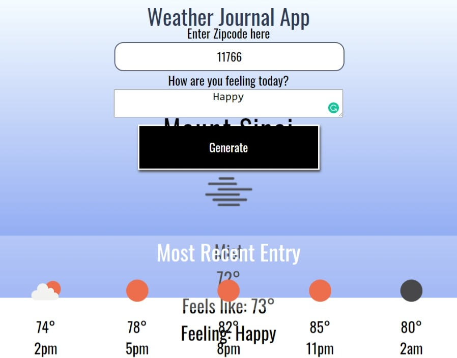

# Weather-journal-app
The second project of Udacity FWD scholarShip. 

## Overview
This project was about creating an asynchronous web app that uses OpenWeatherMap API and user data to dynamically update the UI.

## Result

